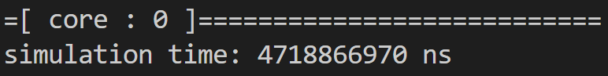
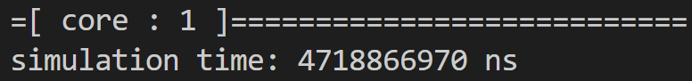

## **EE6470_ESL_Final_project**
### <span style="font-family: '標楷體'; font-weight: lighter;">112062707 廖哲緯</span> 
---
## Topics<br>
- HLS and RISCV-VP Platform
## Methods
I use two kind of images process method to implement at HLS-Stratus and RISCV-VP.<br>
The first method is **Median Blur**<br>
+ Objective: When an image is subjected to salt-and-pepper noise, it can be restored using a median filter.
+ Function: Find the median in the 3 x 3 kernel.
$$h(x, y) = \max_{i, j \in \{-1, 0, 1\}} g(x + i, y + j)$$
The Second method is **Edge Enhancement**<br>
+ After using the first method, the images will seem blurry, but they will become clearer in this part.
+ Function: Laplace sharpening filter can be simplify as:<br>
  <p align="center">
    <code>$$\begin{bmatrix}0 & -1 & 0 \\ -1 & 5 & -1 \\ 0 & -1 & 0\end{bmatrix}$$</code>
  </p>
[ 0 -1 0 ]
[-1 5 -1 ]
[ 0 -1 0 ]
<table>
  <tr>
    <td style="text-align:center;">
      <b>Original</b><br>
      
    </td>
    <td style="text-align:center; vertical-align:middle; font-size: 30px;">
      &nbsp;&rarr;&nbsp;
    </td>
    <td style="text-align:center;">
      <b>Median Blur</b><br>
      
    </td>
    <td style="text-align:center; vertical-align:middle; font-size: 30px;">
      &nbsp;&rarr;&nbsp;
    </td>
    <td style="text-align:center;">
      <b>Edge Enhancement</b><br>
      
    </td>
  </tr>
</table>


## **Section 1 - High Level Synthesis with Stratus**
### Requirment
Implement HLS accelerator PEs<br>
1. Please choose and implement a SystemC-based HLS accelerator PE.
2. Please also implement test bench from the corresponding software to validate the function and timing of a PE.
3. The SystemC PEs should be synthesized with Stratus.
    + PE codes should be simplified for math expressions and bit width.
    + PE should be optimized with loop pipelining, unrolling, etc.
    + Please compare and research the area and performance of different accelerator PE versions. The focus should be placed on the tradeoff of micro-architecture designs vs. area/performance.
### Compile and Execute
```powershell
login EE workstation
$ ssh daisy.ee.nthu.edu.tw
$ ssh ws26
$ source /usr/cadtool/user_setup 01-cadence_license_set.cshset
$ source /usr/cad/cadence/cic_setup/stratus.cshrc
$ source /usr/cadtool/user_setup/03-xcelium.csh
$ cd HLS/sobel_stratus/stratus
$ make sim_B
$ make sim_V_BASIC
$ make V_UNROLL
$ make V_PIPELINE
$ make V_PIPELINE2
$ make V_PIPELINE3
```
### Implementation
HLS\sobel_stratus\SobelFilter.cpp
Using "valid" variable to specify which methods would be done.<br>
valid == 0 method 0<br>
valid == 1 method 1<br>
And also apply **"Loop unroll"** and **"Loop Pipeline"** at this section.
```cpp
		if(valid == 0){
			for (unsigned int v = 0; v<MASK_Y; ++v) {
				for (unsigned int u = 0; u<MASK_X; ++u) {
#ifndef NATIVE_SYSTEMC
					{					
					#ifdef UNROLL
						HLS_UNROLL_LOOP(ON, "unroll");
					#endif
					#ifdef PIPELINE
						HLS_PIPELINE_LOOP(SOFT_STALL, II, "Loop" );
					#endif
					}
#endif
                ...

        }
      }
    }
		if (valid == 1){ 
			for (int q = -1; q != 1 + 1; ++q) {   //-1, 0, 1
				for (int r = -1; r != 1 + 1; ++r) { //-1, 0, 1
#ifndef NATIVE_SYSTEMC
					{					
					#ifdef UNROLL
						HLS_UNROLL_LOOP(ON, "unroll");
					#endif
					#ifdef PIPELINE
						HLS_PIPELINE_LOOP(SOFT_STALL, II, "Loop" );
					#endif
					}
#endif
            ...

				}
			}
		}
```
### Result
The experiment Result can be find at:<br>
HLS\sobel_stratus\stratus\bdw_work\modules\SobelFilter<br>
HLS\sobel_stratus\stratus\bdw_work\sims<br>
And the result show that the **Pipeline I** is the best strategy
<table border="1" style="border-collapse: collapse; color: black;">
  <thead>
    <tr>
      <th style="background-color:#4472C4; color:white;"></th>
      <th style="background-color:#4472C4; color:white;">Total run time(ns)</th>
      <th style="background-color:#4472C4; color:white;">Average Latency(ns)</th>
      <th style="background-color:#4472C4; color:white;">Throughput(pixels/ns)</th>
      <th style="background-color:#4472C4; color:white;">Total Area</th>
    </tr>
  </thead>
  <tbody>
    <tr>
      <td style="background-color:#D9E2F3; color:black;">Basic</td>
      <td style="background-color:#D9E2F3; color:black;">97648560</td>
      <td style="background-color:#D9E2F3; color:black;">30147220</td>
      <td style="background-color:#D9E2F3; color:black;">0.000671141</td>
      <td style="background-color:#D9E2F3; color:red;">8014.6</td>
    </tr>
    <tr>
      <td style="background-color:#EDF2FB; color:black;">Unroll</td>
      <td style="background-color:#EDF2FB; color:black;">78643050</td>
      <td style="background-color:#EDF2FB; color:black;">20644285</td>
      <td style="background-color:#EDF2FB; color:black;">0.000833335</td>
      <td style="background-color:#EDF2FB; color:black;">8969.8</td>
    </tr>
    <tr>
      <td style="background-color:#D9E2F3; color:black;">Pipeline I = 1</td>
      <td style="background-color:#D9E2F3; color:red;">32767950</td>
      <td style="background-color:#D9E2F3; color:red;">4587770</td>
      <td style="background-color:#D9E2F3; color:red;">0.002</td>
      <td style="background-color:#D9E2F3; color:black;">9129.8</td>
    </tr>
    <tr>
      <td style="background-color:#EDF2FB; color:black;">Pipeline II = 2</td>
      <td style="background-color:#EDF2FB; color:black;">45219790</td>
      <td style="background-color:#EDF2FB; color:black;">9830740</td>
      <td style="background-color:#EDF2FB; color:black;">0.00144928</td>
      <td style="background-color:#EDF2FB; color:black;">8980.5</td>
    </tr>
    <tr>
      <td style="background-color:#D9E2F3; color:black;">Pipeline III = 3</td>
      <td style="background-color:#D9E2F3; color:black;">55705560</td>
      <td style="background-color:#D9E2F3; color:black;">13107610</td>
      <td style="background-color:#D9E2F3; color:black;">0.00117647</td>
      <td style="background-color:#D9E2F3; color:black;">8954.6</td>
    </tr>
  </tbody>
</table>

Use image "lena_std_short.bmp" as input
+ **Input image** 


+ **Output image** 


## **Section 2 - RISCV-VP**
### Requirment
Implement multiple accelerator PEs with a multi-core riscv-vp platform
1. Please implement the SystemC PE TLM model for riscv-vp platform.
    + This version can be none-synthesizable, e.g., use sc_fifo.
    + Please use timing (cycles of latency) from synthesized and optimized PE in the SystemC model
2. Please also implement the software on the multi-core processors.
    + Please apply simple data partitioning to allocate tasks to different CPU-PE pairs.
    + The main.cpp will use hartid, mutex and barrier to synchronize tasks from different CPU-PE pairs.
3. Please compute the DMA data amount for input and output data.
    + All memory transactions between memory and hardware PEs should be done with DMA.
    + Please convert DMA data amount to cycles. Each DMA transaction cycle can be modeled = initial cycle + (sent data in bytes/DMA bandwidth). For example, assume a DMA transaction moves 256 bytes and initial cycle=2, DMA bandwith=4 bytes/cycle. Then total DMA cycle=2+ 256/4=66.
4. Please add DMA cycles and PE computation cycles as the total application cycles.
    + We can implement a status register in PE that notifies if the current work is done or not.
    + Software can use a loop to check the register to determine if the task of PE is finished and calculate the total latency for PE.
### Compile and Execute
```powershell
let the path under "*/riscv-vp/"
$ cd riscv-vp/vp/build
$ cmake ..
$ make install
(ref Lab8)
$ cd riscv-vp/sw/basic-sobel
$ make sim
```
### Implementation
In this section I use two cores to do the two methods that mention before.<br>
I will input two different images and two cores will do the two method at the same time and output the two images which was processed at the same time.<br>
**Main Step**<br>
+ Read the two images and send both of the data by DMA (1 pixel/cycle)
+ Do the **Median Blur** when the data was sent and save the result in **sharp_buf[256][256]**
+ After all the data was processed and then start to do **Edge Enhancement**.
+ When each of the pixels was processed by **Edge Enhancement**, they would be send to the sofeware part.**(Done and Send immediately)**

**The Hardware part**<br>
under riscv-vp\vp\src\platform\final_project\SobelFilter.h<br>
I used two buffer to store the data and arrange them.<br>

```cpp
  int median[9];
  int sharp_buf[256][256];
```
**The Software part**<br>
+ I use two images **"lena_color_256_noise.bmp"** and **"lena_std_short_noise.bmp.bmp"** to implement the two core model
+ I use **sem_wait** and **sem_post** to prevent critical section probems because I only use 1 DMA.
+ Write the data and transfer by **"write_data_to_ACC"**
+ Read the data and get by **"read_data_to_ACC"**
+ Using the hart_id to specify with core is working.
+ Save the output imagess in **"lena_color_256_noise_out.bmp"** and **"lena_std_short_noise_out.bmp"**

under riscv-vp\sw\final_project\main.cpp.<br>
```cpp
int sem_wait (uint32_t *__sem){...}
int sem_post (uint32_t *__sem){...}

int main(unsigned hart_id) {
    if (hart_id == 0)
      read_bmp("lena_color_256_noise.bmp",hart_id);
    else if (hart_id == 1)
      read_bmp("lena_std_short_noise.bmp",hart_id); 
    
    ...

    if (hart_id == 0){
        sem_wait(&lock); 
        write_data_to_ACC(SOBELFILTER_START_ADDR, buffer, 4);
        sem_post(&lock);
    }
    else if (hart_id == 1){
        sem_wait(&lock);
        write_data_to_ACC(SOBELFILTER_START_ADDR2, buffer, 4);
        sem_post(&lock);
    }

    ...
    
    if (hart_id == 0){
        sem_wait(&lock);
        read_data_from_ACC(SOBELFILTER_READ_ADDR, buffer, 4);
        sem_post(&lock);
    }
    else if (hart_id == 1){
        sem_wait(&lock);
        read_data_from_ACC(SOBELFILTER_READ_ADDR2, buffer, 4);
        sem_post(&lock);
    }

    ...

    if (hart_id == 0){
      sem_wait(&lock);
      printf("core %d 執行end\n\n",hart_id);
      write_bmp("lena_color_256_noise_out.bmp", hart_id);
      sem_post(&lock);
    }
    else if (hart_id == 1){
      sem_wait(&lock);
      printf("core %d 執行end\n\n",hart_id);
      write_bmp("lena_std_short_noise_out.bmp", hart_id);      
      sem_post(&lock);
    }
}
```
### Result
The initial cycle is 10ns and DMA sent a pixel by a cycle,
so the total DMA cycle = 10 + 256 = 236.<br>
With the average latency by HLS : 4587770 ns<br>
The total simulation time is: 4718866970 ns<br>
But we can do two images at the same time, so the total simulation time may can be divide by 2: 2359433485 ns <br><br>
**Output image** <br>

**Core 0**
<table>
  <tr>
    <td style="text-align:center;">
      
    </td>
    <td style="text-align:center; vertical-align:middle;">
      <p><b>Median Blur and Edge Enhancement</b></p>
      <p style="font-size: 100px;">&#8594;</p>
    </td>
    <td style="text-align:center;">
      
    </td>
  </tr>
</table>

**Core 1**
<table>
  <tr>
    <td style="text-align:center;">
      
    </td>
    <td style="text-align:center; vertical-align:middle;">
      <p><b>Median Blur and Edge Enhancement</b></p>
      <p style="font-size: 100px;">&#8594;</p>
    </td>
    <td style="text-align:center;">
      
    </td>
  </tr>
</table>






